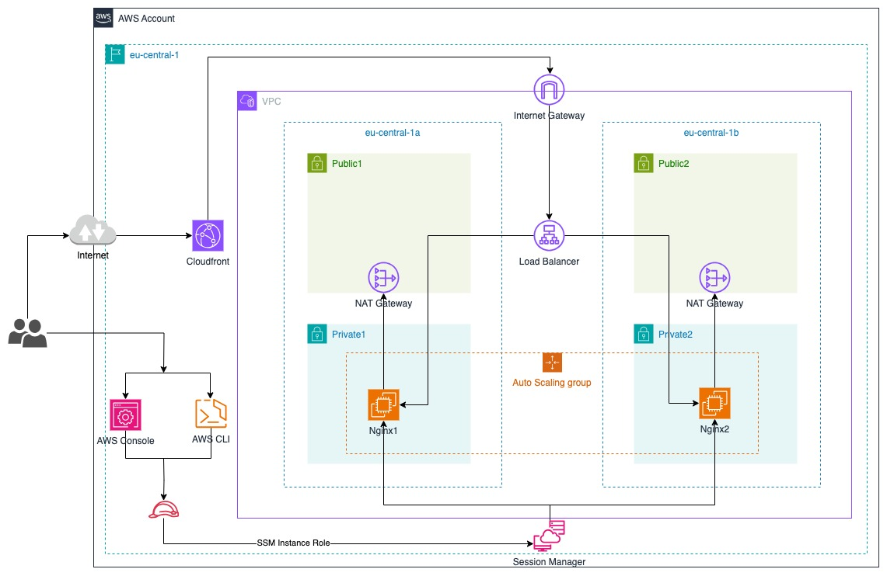

## Description

This demo project is a comprehensive Terraform setup designed to automate the creation and management of a robust AWS infrastructure. The infrastructure includes a VPC, Subnets, Security Groups, EC2 instances, a Load Balancer, an Autoscaling Group, Cloudfront, and an SSM Role

The project is organized into modules for better manageability and reusability. Each module is responsible for creating a specific part of the infrastructure. The main file, main.tf, orchestrates the creation of the entire infrastructure by calling these modules with appropriate parameters.

Key features of the project include:

####  1. VPC and Subnets: 
The project sets up a VPC with a specified CIDR block and creates public and private subnets within this VPC.  

#### 2. Security Groups: 
Security groups for the Nginx server and the Application Load Balancer (ALB) are created, with rules allowing necessary inbound and outbound traffic.  

#### 3. EC2 Instances: 
EC2 instances are launched in the private subnet with an attached IAM role for SSM access. The instances are configured to run an Nginx server.  

#### 4. Load Balancer: 
An Application Load Balancer is set up in the public subnet to distribute incoming traffic across the EC2 instances.  

#### 5. Autoscaling Group: 
An Autoscaling Group is configured to ensure that the number of EC2 instances running the Nginx server scales up or down based on demand.  

#### 6. Cloudfront: 
A Cloudfront distribution is created to cache the content closer to the users and improve the application's performance.  

#### 7. SSM Role: 
An IAM role with SSM permissions is created and attached to the EC2 instances for secure and efficient management.  

#### 8. Blue/Green Deployment: 
The project supports blue/green deployment strategy, allowing for zero-downtime deployments and rollbacks.

The project is designed to be flexible and configurable, with many of the parameters (like VPC CIDR block, instance type, etc.) being configurable through variables. It follows best practices for security and performance, making it a solid starting point for any AWS-based application deployment.

## Requirements

This project requires Terraform v0.14.0 or higher. You can download Terraform from [here](https://www.terraform.io/downloads.html).

## Usage

The project contains a Makefile to simplify the execution of common commands. In-order to play around with the project, you can use the following commands:

1. `make plan`: Shows the execution plan.
2. `make apply`: Applies the changes.
3. `make destroy`: Destroys the infrastructure.

Make sure to have the aws configuration set up on your machine before running the above commands. You can set up the aws configuration by running `aws configure` on your machine.

## Providers

This project uses the following providers: 
- aws: to create and manage AWS resources

## Modules

| Name | Source | Version |
|------|--------|---------|
|  [autoscaling](#module\_autoscaling) | ./modules/autoscaling | n/a |
|  [cloudfront](#module\_cloudfront) | ./modules/cloudfront | n/a |
|  [ec2](#module\_ec2) | ./modules/ec2 | n/a |
|  [load\_balancer](#module\_load\_balancer) | ./modules/load_balancer | n/a |
|  [security\_groups](#module\_security\_groups) | ./modules/security_groups | n/a |
|  [ssm\_role](#module\_ssm\_role) | ./modules/ssm_role | n/a |
|  [subnets](#module\_subnets) | ./modules/subnets | n/a |
|  [vpc](#module\_vpc) | ./modules/vpc | n/a |

## Author

- Harisankar Ramachandran
    - [mrsank@live.in](mailto:mrsank@live.in)

Contributions:
- Developed the initial version of the project.
- Maintains the project and handles updates.